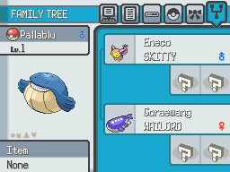
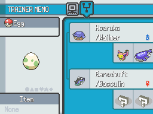

# Family Tree
This script is for Pokémon Essentials. It displays a sixth page at pokémon summary showing a little info about the pokémon mother, father, grandmothers and grandfathers if the pokémon has any.

## Screens

## Compatibility
Doesn't work on Essentials versions older than v21.1. To see other Essentials versions, look at [all branches](../../branches/all).

## Installation
Follow the [Script](/Script.rb) instructions. The sample script files are in [Files folder](/Files).
