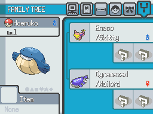

# Family Tree
This script is for Pokémon Essentials. It displays a sixth page at pokémon summary showing a little info about the pokémon mother, father, grandmothers and grandfathers if the pokémon has any.

## Screens

## Compatibility
Doesn't work on Essentials versions older than v21.1. To see other Essentials versions, look at [all branches](../../branches/all).

## Installation
Download from [here](https://github.com/abacaxi-queer/Essentials-FamilyTree/releases/download/v2.0/Family.Tree.zip) and extract the contents in your root game folder. This plugin requires the [Modular UI Scenes](https://reliccastle.com/resources/1325/) from Lucidious89. 
